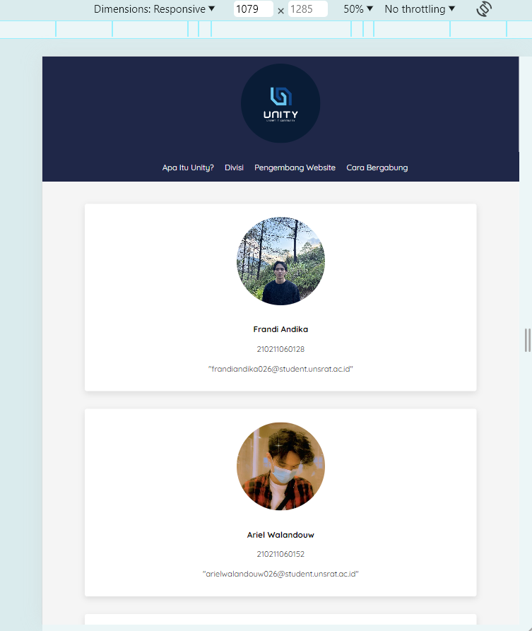
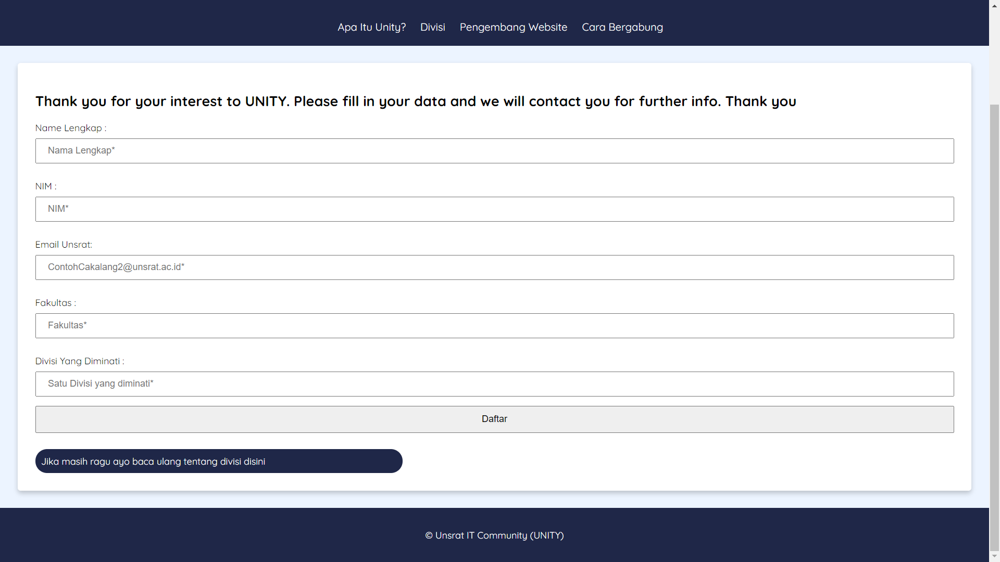

# Final-Project-UAS-Web
Project UAS Mata Kuliah Pemrograman Web

Website bertemakan Unsrat IT Community dibuat dengan HTML, CSS, JS, dan PHP.

<h1> Preview Website </h1>

<figure>
  <figcaption style="text-align:center;"> Main </figcaption>
  
</figure>

<figure>
  
</figure>

<figure>
  <figcaption style="text-align:center;"> Divisi </figcaption>
  
</figure>

<figure>
  <figcaption style="text-align:center;"> Bagian Pengembang Web </figcaption>
  
</figure>

<figure>
  <figcaption style="text-align:center;"> Bagian cara bergabung </figcaption>
  
</figure>
